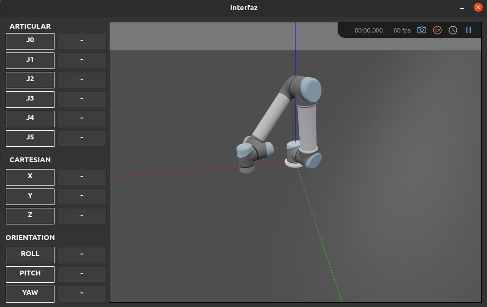

# Interfaz hombre-máquina mediante estimación de pose

  

## Índice:
  
  - [1.   Introducción](#p1)
  - [2.   Instalación](#p2)  
  - [3.   Cómo usar](#p3)
  - [3.1  Interfaz modo Base](#p4)
  - [3.2  Interfaz modo Gazebo](#p5)
  - [3.3  Interfaz modo Demo](#p6)
  - [4. Video](#p7)
  - [5. Creditos](#p8)  

## Introducción: <a name="p1"/>

Este es el proyecto de mi trabajo de fin de grado en la carrera de Ingeniería Robótica, en la Universidad de Alicante. El proyecto se ha desarrollado en `Ubuntu 20.04.4` y programando en Python 3. La interfaz permite controlar una simulación en el entorno Gazebo de un robot UR y también controlar un robot real.

## Instalación: <a name="p2"/>

Las dependencias necesarias para que funcione el proyecto se pueden instalar automáticamente a partir del fichero `requirements.txt` mediante el siguiente comando.

    $ pip3 install -r requirements.txt

Por otra parte, si se quiere utilizar la interfaz para controlar un robot en Gazebo, es necesario instalar el [paquete](https://github.com/UniversalRobots/Universal_Robots_ROS_Driver) de Universal Robots para ROS. La conexión entre Gazebo y la interfaz se ha hecho en `ROS Noetic`.

    # source global ros
    $ source /opt/ros/<your_ros_version>/setup.bash
    
    # create a catkin workspace
    $ mkdir -p catkin_ws/src && cd catkin_ws
    
    # clone the driver
    $ git clone https://github.com/UniversalRobots/Universal_Robots_ROS_Driver.git src/Universal_Robots_ROS_Driver
    
    # clone fork of the description. This is currently necessary, until the changes are merged upstream.
    $ git clone -b calibration_devel https://github.com/fmauch/universal_robot.git src/fmauch_universal_robot
    
    # install dependencies
    $ sudo apt update -qq
    $ rosdep update
    $ rosdep install --from-paths src --ignore-src -y
    
    # build the workspace
    $ catkin_make
    
    # activate the workspace (ie: source it)
    $ source devel/setup.bash

## Cómo usar: <a name="p3"/>

Para iniciar el proyecto, es necesario haber realizado la calibración de las cámaras y del estéreo en primer lugar. Para ello hace falta utilizar un tablero de 10x7 cuadrados. En la siguiente página se puede configurar a gusto el tablero que queramos: [Generate Your Own Checkerboards](https://markhedleyjones.com/projects/calibration-checkerboard-collection).

  

La calibración de las cámaras se lleva a cabo ejecutando el código `camera_calibration.py`, tras realizarla, se puede calibrar el estéreo mediante el código `stereo_calibration.py`. Tras realizar estos dos pasos, ya es posible comenzar a utilizar el proyecto.

El proyecto está configurado para usarse en un UR3. En caso de que queramos utilizar otro robot podemos definirlo en el fichero `main.py` a mano utilizando los valores de Denavit–Hartenberg. Para saber cómo definir un robot a mano, revisar la [Robotics Toolbox for Python](https://github.com/petercorke/robotics-toolbox-python) de Peter Corke. Si se define a mano el robot, la interfaz se lanzará con una representción sencilla hecha en PyPlot. Si se carga un modelo de la Robotics Tooblox de Peter Corke que cuente con su modelo en 3D, se lanzará la interfaz con una simulación de Swift.

  
  

En caso de que no se disponga de dos cámaras, el proyecto cuenta con dos vídeos y la calibración de las cámaras y el estéreo que se utilizó para obtenerlos. Por lo que se puede ejecutar la interfaz sin necesidad de disponer de ninguna cámara ni de realizar la calibración. Para lanzar el proyecto en este modo, es necesario ejecutar el `pose_stereo.py` con el argumento ”-vid”: 

    $ python3 pose_stereo.py -vid.

### Interfaz modo Base: <a name="p4"/>

Para ejecutar la interfaz en modo base, hay que ejecutar el fichero `main.py` y elegir `modo 1`. Esto lanzará solamente la interfaz y se quedará a la espera de que se conecte el cliente del detector de pose. Para lanzar el detector de pose, hay que ejecutar el fichero `pose_stereo.py`. Tras esto, se iniciará la aplicación y se moverá la simulación de la interfaz en función de la posición detectada para la mano izquierda.

    # Lanzar en un terminal:
    $ python3 main.py
    
    # Lanzar en otro terminal:
    $ python3 pose_stereo.py

### Interfaz modo Gazebo: <a name="p5"/>

Para ejecutar la interfaz en modo gazebo, hay que ejecutar el fichero `main.py` y elegir `modo 2`. Esto lanzará la interfaz y se quedará a la espera de que se conecte el cliente del detector de pose. Además, esta vez intentará leer y publicar en los topics `/joint_states` y `/pos_joint_traj_controller/command` de ROS Noetic para controlar la simulación Gazebo que se ha iniciado. La simulación en Gazebo se puede lanzar desde el paquete `ur_gazebo`

    # Lanzar en un terminal:
    $ python3 main.py
    
    # Lanzar en otro terminal:
    roslaunch ur_gazebo ur<modelo>_gringup.launch
    
    # Lanzar en otro terminal:
    python3 pose_stereo.py

### Interfaz modo Demo: <a name="p6"/>

Para ejecutar la interfaz en modo demo, hay que ejecutar el fichero `main.py` y elegir `modo 3`. Esto lanzará la interfaz y se quedará a la espera de que se conecten los clientes del detector de pose y del robot real que queremos controlar. Para controlar el robot real, hay que cargarle a este el código `ur3_control.urp`.

    # Lanzar en un terminal:
    $ python3 main.py
    
    # Lanzar en otro terminal:
    python3 pose_stereo.py
    
    # Iniciar programa en el robot real.
    
*Nota: la aplicación está diseñada para enviar y recibir mensajes mediante conexión TCP/IP con el robot real. El programa de ur_control.urp está pensado para controlar un UR3. En caso de que se quiera controlar otro robot, es necesario modificar el fichero  `simulation_demo.py`.*

Para iniciar la interfaz, hay que ejecutar el fichero main.py, el cual permite seleccionar el
modo en el que se quiere utilizar la interfaz. En el modo base solo se puede controlar la representación del robot integrada en la interfaz. El modo Gazebo, que necesita que previamente
se haya lanzado el launch del controlador, permite controlar tanto la representación del robot como una simulación de este en Gazebo. Por último, el modo demo permite controlar un
brazo robot en tiempo real iniciando un servidor.
Si se quiere iniciar el modo Gazebo, previamente hay que lanzar el launch del controlador
del robot que queramos controlar. El comando para hacerlo es el siguiente.
1 $ roslaunch ur_gazebo UR<modelo>_bringup.launch
Por otra parte, si se quiere controlar el robot real, la demo está preparada para comunicarse
con un UR3. Dentro de la carpeta del proyecto se encuentra el fichero ur3_control.urp. Este
es el programa que debe ejecutarse desde el robot real para que pueda comunicarse con la
aplicación y moverse.

## Vídeo: <a name="p7"/>

Demostración probando la interfaz con un robot UR3: [vídeo](https://www.youtube.com/watch?v=e_8cTOLwNLA)

  

## Créditos: <a name="p8"/>

Este proyecto es un trabajo de final de grado hecho por: *Adrián Sanchis Reig*

**Contacto**
 
  -  https://www.linkedin.com/in/sradrian/
  - :email:
  
  
  
