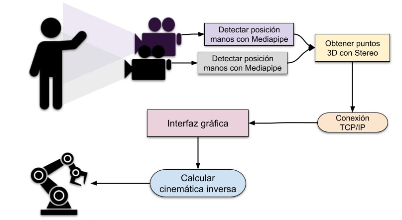

# Interfaz hombre-máquina mediante estimación de pose

  

## Índice:
  
  - [1. Introducción](#p1)
  - [2. Instalación](#p2)  
  - [3. Ejemplos de uso](#p3)
  - [4. Video](#p4)
  - [5. Creditos](#p5)  

## Introducción: <a name="p1"/>

Este es el proyecto de mi trabajo de fin de grado en la carrera de Ingeniería Robótica, en la Universidad de Alicante. El proyecto se ha desarrollado en `Ubuntu 20.04.4` y programando en Python 3. La interfaz permite controlar una simulación en el entorno Gazebo de un robot UR y también controlar un robot real.

## Instalación: <a name="p2"/>

Las dependencias necesarias para que funcione el proyecto se pueden instalar automáticamente a partir del fichero `requirements.txt` mediante el siguiente comando.

    $ pip3 install -r requirements.txt

Por otra parte, si se quiere utilizar la interfaz para controlar un robot en Gazebo, es necesario instalar el [paquete](https://github.com/UniversalRobots/Universal_Robots_ROS_Driver) de Universal Robots para ROS. La conexión entre Gazebo y la interfaz se ha hecho en `ROS Noetic`.

    # source global ros
    $ source /opt/ros/<your_ros_version>/setup.bash
    
    # create a catkin workspace
    $ mkdir -p catkin_ws/src && cd catkin_ws
    
    # clone the driver
    $ git clone https://github.com/UniversalRobots/Universal_Robots_ROS_Driver.git src/Universal_Robots_ROS_Driver
    
    # clone fork of the description. This is currently necessary, until the changes are merged upstream.
    $ git clone -b calibration_devel https://github.com/fmauch/universal_robot.git src/fmauch_universal_robot
    
    # install dependencies
    $ sudo apt update -qq
    $ rosdep update
    $ rosdep install --from-paths src --ignore-src -y
    
    # build the workspace
    $ catkin_make
    
    # activate the workspace (ie: source it)
    $ source devel/setup.bash

## Ejemplos de uso: <a name="p3"/>

## Vídeo: <a name="p4"/>

Haz click en el gif para ir al vídeo de demostración con un robot real.

 &nbsp; and &nbsp;

hola mundooo

  

## Créditos: <a name="p5"/>

Este proyecto es un trabajo de final de grado hecho por Adrián Sanchis Reig
